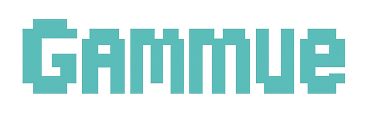

<div id="top"></div>

<div align='center'>

<h1><b>Gammue - 게임 커뮤니티</b></h1>
<h3><b>프로그래머스 4기 5회차 소셜 네트워크 프로젝트</b></h3>

🔗 [배포 링크](https://)



</div>

<br>

## 0. 목차

1. [프로젝트 소개](#1)
2. [팀원 소개](#2)
3. [개발 일정](#3)
4. [기술 스택](#4)
5. [라이브러리 사용 이유](#5)
6. [컨벤션](#6)
7. [브랜치 및 디렉토리 구조](#7)
8. [주요 기능 소개](#8)
9. [상세 담당 업무](#9)
10. [시작 가이드](#10)

<br />

## <span id="1">🚩 1. 프로젝트 소개</span>

**Notion**: [프로젝트 노션 링크](https://www.notion.so/2-Gammue-1f8871ecd4fe80a085fcd94e50857de5?pvs=4)

**PPT**: [프로젝트 발표 자료](https://www.figma.com/slides/V98IsZ9y8YXsbMxkMaBr78/-FE5--2%EC%B0%A8-5%ED%8C%80-FiveCoders-%EB%B0%9C%ED%91%9C%EC%9E%90%EB%A3%8C?node-id=1-553&t=6wXqQv7l6L50ZQI0-1)

React + TypeScript를 활용하여 게임 커뮤니티용 소셜 네트워크 서비스를 구현.

<br>

<!-- Top Button -->
<p style='background: black; width: 32px; height: 32px; border-radius: 50%; display: flex; justify-content: center; align-items: center; margin-left: auto;'><a href="#top" style='color: white; '>▲</a></p>

<br>

## <span id="2">🏃 2. 팀원 소개</span>

|                                                        |                                                           |                                                        |                                                           |                                                        |
| :--------------------------------------------------------------------------------------------------------------------: | :--------------------------------------------------------------------------------------------------------------------: | :--------------------------------------------------------------------------------------------------------------------: | :--------------------------------------------------------------------------------------------------------------------: | :--------------------------------------------------------------------------------------------------------------------: |
|  |  |  |  |  |
|                                          [이재건](https://github.com/79gun79)                                          |                                         [김은지](https://github.com/keemeunji)                                         |                                          [박은서](https://github.com/snowari)                                          |                                          [이지윤](https://github.com/wolwha)                                           |                                         [최원일](https://github.com/won431236)                                         |
|                                                          팀장                                                          |                                                         디자인                                                         |                                                     외부 API 연결                                                      |                                                 디자인, 외부 API 연결                                                  |                                                     발표 자료 작성                                                     |
|                                                  게시글 & 좋아요 구현                                                  |                                                  커뮤니티 & 알림 구현                                                  |                                        인증 & 사이드바 & 구독 구현, 인기글 기능                                        |                                                    회원 페이지 구현                                                    |                                                    검색 & 댓글 구현                                                    |

<br>

<!-- Top Button -->
<p style='background: black; width: 32px; height: 32px; border-radius: 50%; display: flex; justify-content: center; align-items: center; margin-left: auto;'><a href="#top" style='color: white; '>▲</a></p>

<br>

## <span id="3">📅 3. 개발 일정</span>

> 프로젝트 개발 기간: 2025.04.25 - 2025.05.19 (25일)

<br>

<!-- Top Button -->
<p style='background: black; width: 32px; height: 32px; border-radius: 50%; display: flex; justify-content: center; align-items: center; margin-left: auto;'><a href="#top" style='color: white; '>▲</a></p>

<br>

## <span id="4">📚 4. 기술 스택</span>

### Environment


### Config


### Development


### Project Management

[Github Pull requests](https://github.com/79gun79/FiveCoders/pulls?q=is%3Apr+is%3Aclosed)

### Design

[Figma](https://www.figma.com/design/Cf8QG5w2iMudMXxj9y0w64/-FE5--2%EC%B0%A8-5%ED%8C%80-FiveCoders-%ED%94%84%EB%A1%9C%EC%A0%9D%ED%8A%B8?node-id=178-95&t=Iqhom9eQW8S5DTvP-1)

### Hosting


### Communication


<br>

<!-- Top Button -->
<p style='background: black; width: 32px; height: 32px; border-radius: 50%; display: flex; justify-content: center; align-items: center; margin-left: auto;'><a href="#top" style='color: white; '>▲</a></p>

<br>

## <span id="5">❓ 5. 라이브러리 사용 이유</span>

> React + TypeScript: 프로젝트 환경

<br>

> Zustand: 전역 상태 설정

<br>

> Axios: API 통신

<br>

> Tailwind CSS: 스타일

<br>

<!-- Top Button -->
<p style='background: black; width: 32px; height: 32px; border-radius: 50%; display: flex; justify-content: center; align-items: center; margin-left: auto;'><a href="#top" style='color: white; '>▲</a></p>

<br>

## <span id="6">🤝 6. 컨벤션</span>

### prettier

```json
{
  "semi": true,
  "singleQuote": true,
  "tabWidth": 2,
  "useTabs": false,
  "plugins": ["prettier-plugin-tailwindcss"]
}
```

### 커밋 컨벤션

| **타입** | **설명**                                     | **깃모지** |
| -------- | -------------------------------------------- | ---------- |
| feat     | 새로운 기능 추가                             | ✨         |
| refactor | 코드 리팩토링                                | 🔨         |
| fix      | 버그 수정                                    | 🐛         |
| chore    | 패키지 매니저, 설정 세팅                     | 📦         |
| init     | 초기 세팅 및 종속성 추가 관련                | 🌱         |
| docs     | 문서 수정                                    | 📝         |
| pencil   | 오탈자 또는 문구, 변수명 수정                | ✏️         |
| zap      | 기능 개선 및 변경                            | ⚡️        |
| poop     | 코드 또는 파일 삭제                          | 💩         |
| design   | 문서 수정                                    | 🎨         |
| style    | 코드 포맷팅, 세미콜론 누락 등 코드 변경 없음 | 💄         |
| test     | 테스트 코드, 리팩토링 테스트 코드 추가       | ✅         |

#### 커밋 예시

- ✨ feat: 페인페이지 레이아웃 구현
- 🐛 fix: 잘못된 날짜 형식 문제 해결

<br>

<!-- Top Button -->
<p style='background: black; width: 32px; height: 32px; border-radius: 50%; display: flex; justify-content: center; align-items: center; margin-left: auto;'><a href="#top" style='color: white; '>▲</a></p>

<br>

## 7.<span id="7"> 🗂️ 브랜치 및 디렉토리 구조</span>

> 브랜치

- `main`: 배포 전용 브랜치, 항상 안정적인 상태 유지
- `dev`: 개발 통합 브랜치, 기능 완성 후 merge
- `feature/기능`: 기능 단위 작업 브랜치, 기능마다 분기해서 작업 진행

<br>

> 디렉토리 구조

```
📂 FiveCoders
├── 📂 src
│   ├── 📂 assets          # 이미지, 아이콘 등 정적 리소스
│   │   ├── 📂 icons
│   │   ├── 📂 imgs
│   ├── 📂 components      # 컴포넌트 관련 파일 (재사용 가능한 UI)
│   ├── 📂 css             # 전역 스타일 모음
│   ├── 📂 data            # 프로젝트 적용을 위한 데이터 파일
│   ├── 📂 pages           # 라우트 단위 페이지 파일
│   ├── 📂 services        # API 통신 모듈
│   ├── 📂 store           # 전역 상태 관리 파일
│   ├── 📂 types           # 타입스크립트 타입 정의
│   ├── 📂 utils           # 유틸리티 파일(함수)
│   └── 📄 App.tsx          # 메인 App 컴포넌트
│   └── 📄 main.tsx
│   └── 📄 router.tsx       # 라우터 설정
├── 📂 public
│   └── 📄 favicon.ico     # 사이트 아이콘
└── 📄 package.json        # 프로젝트 종속성 및 설정 파일
└── 📄 tsconfig.json       # 타입스크립트 설정 파일
```

<br>

<!-- Top Button -->
<p style='background: black; width: 32px; height: 32px; border-radius: 50%; display: flex; justify-content: center; align-items: center; margin-left: auto;'><a href="#top" style='color: white; '>▲</a></p>

<br>

## <span id="8">8. 💻 주요 기능 소개</span>

### 1) 홈

| 메인 화면                                                                                                                        | 검색 화면                                                                                                                        | 내 정보 화면                                                                                                                     |
| -------------------------------------------------------------------------------------------------------------------------------- | -------------------------------------------------------------------------------------------------------------------------------- | -------------------------------------------------------------------------------------------------------------------------------- |
|  |  |  |

### 2) 게시글

| 커뮤니티 리스트                                                                                                                  | 특정 커뮤니티                                                                                                                    | 게시물 작성                                                                                                                      |
| -------------------------------------------------------------------------------------------------------------------------------- | -------------------------------------------------------------------------------------------------------------------------------- | -------------------------------------------------------------------------------------------------------------------------------- |
|  |  |  |

### 3) 기타

| 로그인 화면                                                                                                                      | 채널 생성 화면                                                                                                                   | 404 화면                                                                                                                         |
| -------------------------------------------------------------------------------------------------------------------------------- | -------------------------------------------------------------------------------------------------------------------------------- | -------------------------------------------------------------------------------------------------------------------------------- |
|  |  |  |

<br>

<!-- Top Button -->
<p style='background: black; width: 32px; height: 32px; border-radius: 50%; display: flex; justify-content: center; align-items: center; margin-left: auto;'><a href="#top" style='color: white; '>▲</a></p>

<br>

## <span id="9">9. 📄 상세 담당 업무</span>

### 1) 이재건

- **✨ 팀장**

  - 프로젝트 초기 세팅 및 관리
  - 노션페이지 작성 및 회의 진행

- **💻 화면 개발**

  - 각 커뮤니티 화면
  - 게시글 작성, 수정 화면
  - 댓글 작성, 좋아요 화면

- **🛠 구현 기능**

  - 게시글 작성 및 수정
  - 내 게시글, 검색 게시글 바로가기
  - 좋아요 기능

### 2) 김은지

- **🎨 디자인**

  - 전체적인 UI 디자인

- **💻 화면 개발**

  - 커뮤니티 목록 화면
  - 커뮤니티 생성 화면(관리자)
  - 알림 팝업창 화면

- **🛠 구현 기능**

  - 커뮤니티 생성 기능
  - 좋아요와 댓글 알림 기능

### 3) 박은서

- **📑 문서 관리**

  - 프로젝트 초기 세팅 및 관리
  - 와이어프레임 및 피그마 제작

- **💻 화면 개발**

  - 로그인, 회원 가입 화면
  - 사이드바 화면(반응형 제작)
  - 홈 외부 API, 인기글 화면
  - 404 오류 화면

- **🛠 구현 기능**

  - 로그인, 회원 가입 기능
  - 커뮤니티 구독 기능
  - 모든 유저 표시(로그인 표시)
  - 외부 API 연결 (스팀, 디스코드)
  - 뉴스 캐로셀
  - 오늘의 인기글 표시 기능

### 4) 이지윤

- **🎨 디자인**

  - 전체적인 UI 디자인

- **💻 화면 개발**

  - 사용자 프로필 화면
  - 프로필 수정 화면
  - 홈 외부 API 화면

- **🛠 구현 기능**

  - 사용자 프로필 수정 기능
  - 사용자 아이디, 비밀번호 설정 기능
  - 타 사용자 프로필 확인 기능
  - 외부 API 연결(던전앤파이터)

### 5) 최원일

- **📑 문서 관리**

  - 프로젝트 발표 자료 작성

- **💻 화면 개발**

  - 검색 바를 포함한 상단 바
  - 비어있는 컨텐츠 화면
  - 검색 결과 화면

- **🛠 구현 기능**

  - 게시글, 사용자 검색 기능
  - 댓글 작성, 조회, 삭제 기능
  - 다중 클릭 방지 기능

<br>

<!-- Top Button -->
<p style='background: black; width: 32px; height: 32px; border-radius: 50%; display: flex; justify-content: center; align-items: center; margin-left: auto;'><a href="#top" style='color: white; '>▲</a></p>

<br>

## <span id="10">10. 🛠️ 시작 가이드</span>

### Installation

```shell
# 1. 클론하기
$ git clone https://github.com/79gun79/FiveCoders.git .

# 2. 의존성 설치하기
$ npm install

# 3. 개발 서버 실행하기
$ npm run dev
```

<br>

<!-- Top Button -->
<p style='background: black; width: 32px; height: 32px; border-radius: 50%; display: flex; justify-content: center; align-items: center; margin-left: auto;'><a href="#top" style='color: white; '>▲</a></p>
